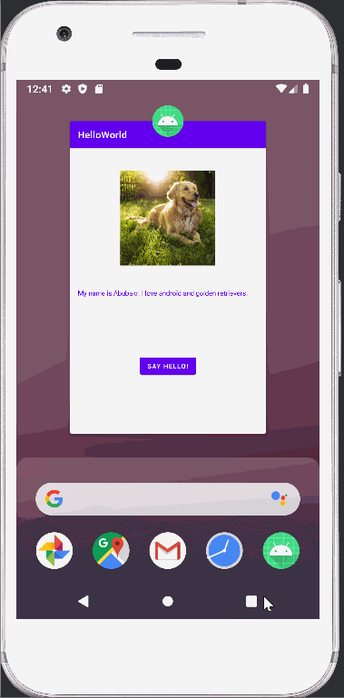
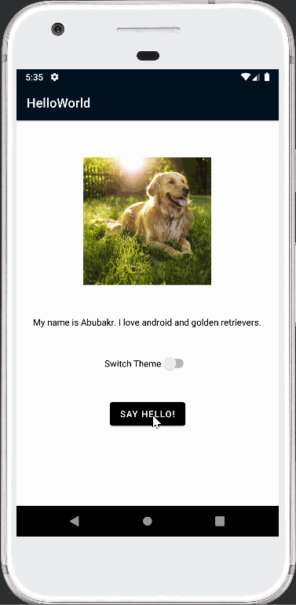

# Android Prework - *HelloWorld1*

Submitted by: **Abubakr El Sobky**

**HelloWorld1** is an android app that shows an image and introductory message, allows pressing a button to display a Toast, and allows swithcing between both dark and light themes. 

Time spent: **10** hours spent in total

## Required Features

The following **required** functionality is completed:

* [√] Image and introductory message displayed on screen
* [√] Button displayed on screen
* [√] Toast with message appears when button is pressed 

The following **optional** features are implemented:

* [√] Added a switch that can chage the app's theme between both dark and light modes.
* [√] Changed text, button, and background colors to suit the newly implemented themes.  

## Video Walkthrough

Here's a walkthrough of the **required** implemented features:

Here's a walkthrough of the **optional** implemented features:

<!-- Replace this with whatever GIF tool you used! -->
Both GIF files were created with LICEcap  
<!-- Recommended tools:
[Kap](https://getkap.co/) for macOS
[ScreenToGif](https://www.screentogif.com/) for Windows
[peek](https://github.com/phw/peek) for Linux. -->

## Notes

I definitely faced some challneges as I was trying to look for new optional features to implement. First I went through links and reources in your suggested (Improve the UI / UX of your app) link. Some links were not working. The other links, howver, cointained a lot of information that was not wasy to navigate. I tried to impelent some of ht UI designs that I found but finding actionable steps was preety challneging. Eventually, I decided to implement dark and light themes to my app using a switch. While I found many resources, they were not easy to understand and follow. Another challenge too was integrating the optional features with my existing code while maintaining the app's required functinality. After spending more time online with trial and error, I was finally able to add a switch that allows my app to switch between both the dark and light themes.

PS: In the first submission, I added the HelloWorld project which has only the required features. In the second submission, I added the HelloWorld1 project which has both the required and optional features along with two gif walkthroughs to demonstrate them.

## License

    Copyright [yyyy] [name of copyright owner]

    Licensed under the Apache License, Version 2.0 (the "License");
    you may not use this file except in compliance with the License.
    You may obtain a copy of the License at

        http://www.apache.org/licenses/LICENSE-2.0

    Unless required by applicable law or agreed to in writing, software
    distributed under the License is distributed on an "AS IS" BASIS,
    WITHOUT WARRANTIES OR CONDITIONS OF ANY KIND, either express or implied.
    See the License for the specific language governing permissions and
    limitations under the License.
